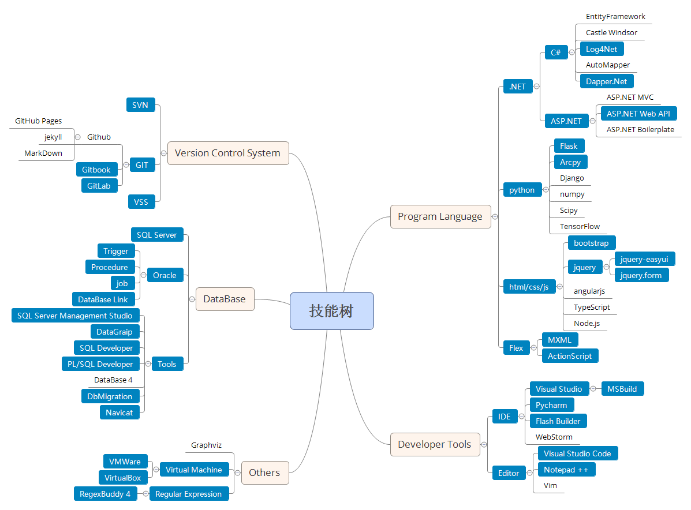

```
论一个逗比的自我修养
```

# 技能树



> 注： 图中蓝色部分为实际在项目中运用过的技能

 - `Program Language`
    + `.NET`
       * `ASP.NET WebForm` 基础维护的电子政务平台的相关系统皆是基于 ASP.NET WebForm 建立的，
         而后又独立开发了移动端后台数据管理系统
       * `ASP.NET WebAPI` 使用 ASP.NET WebAPI 技术开发基础数据提报服务，用于导出 word/excel/附件数据
    + `python`
       * `Flask/Arcpy` 使用 Flask 制作基础数据提报服务中的图形导出服务部分，
         其中 Arcpy 用于将图形数据导出到指定文件夹，Flask 则负责提供 REST 服务
    + `Flex`
       * `MXML/ActionScript` 毕业设计基于 ArcGIS Server 制作人口分析程序，
         而后在参加工作后参与电子政务平台的 Flex 图形端的维护工作
- `Version Control System`
    + `VSS` 在工作初期使用的老版本的 VSS 来管理代码
    + `SVN` 而后，在服务器迁移之后，改用了新的 SVN 来管理代码
    + `GIT` 最后，从项目现场撤出之后，因为项目现场与办事处不在同一网络，改用了 GIT 版本管理器，
     以补丁的形式进行代码的更新，并在办事处建立 GitLab 服务器进行代码管理
- `DataBase`
    + `Oracle` 使用 Database Link 来连接远程数据库，并编写存储过程进行数据抽取，
      然后在数据表上添加触发器进行及时的数据推送，最后使用 job 来实现定时任务
    + `SQL Server` 进行过表值函数、标量值函数、存储过程的编写

# 工作经历

```
2013.07-2017.05 **武大吉奥信息技术有限公司**
```
  
在该公司主要负责沈阳“一张图”电子政务平台相关功能模块的开发和维护功能，以及后期不动产统一登记平台相关的开发。

<div class="alert alert-info" style="margin-left: 20px">沈阳“一张图”电子政务平台</div>

 - 维护MSSQL+ASP.NET开发的业务审批及OA系统，利用UCML工作流引擎完成相关新流程的开发及现有流程的维护
 - 开发WebService后台服务接口为移动办公APP提供后台服务，并基于Oracle+ASP.NET+jQuery EasyUI开发后台数据管理系统
 - 使用ASP.NET Web API技术开发数据导出接口，在现有系统中嵌入数据导出模块
 - 维护基于ArcGIS API For Flex开发的图形端程序  
  
<div class="alert alert-info" style="margin-left: 20px">不动产统一登记平台</div>

 - 利用ETL工具Kettel抽取“一张图”数据[SQL Server]到不动产登记平台[Oracle]
 - 基于不动产平台开发相关的流程及表单
 - Oracle数据库中制作触发器、存储过程、数据库连接用于与中间库数据之间的交互

# 项目经历

<div class="alert alert-warning" style="margin-left: 20px">沈阳“一张图”电子政务平台</div>

> Visual Studio 2005 + .NET 2.0 + SQL Server 2005（后期升级为 Visual Studio 2013 + .NET 4.0）

沈阳“一张图”电子政务平台旨在实现全局空间数据管理和全局办公的信息化，
其上包括一系列的子系统，包括：业务审批、行政办公、数据汇交、成果管理、
重点项目、调控监测等子系统，系统基于 SQL Server + UCML + .NET + ArcGIS + Oracle 建设，
其中 MIS 数据使用 SQL Server 管理，GIS 数据依托 ArcGIS 使用 Oracle 进行存储，
建立 ASP.NET 网站进行业务审批及日常办公，并内嵌 Flex 图形端用于调用 GIS 数据，
实现了“图文一体”的审批方式。平台上主要工作内容如下：

 - `业务审批/行政办公系统` 主要基于 UCML 工作流平台进行现有流程的维护及新业务流程的开发，
   并根据现有的市局版本进行各个分局版本的移植、定制开发
 - `数据汇交系统` 使用三层架构开发，主要工作内容包括现有模块维护及新模块开发，
   并且维护业务审批库到数据汇交库的数据抽取工具
 - `成果管理系统` 以土地为单元，进行土地的全生命周期显示，主要工作为在串联模块上添加新的业务模块
 - `调控监测/综合监管系统` 主要用于各种数据指标的展示，在其上制作了供地率统计，批而未供等模块的开发

<div class="alert alert-warning" style="margin-left: 20px">沈阳移动办公平台</div>

> Visual Studio 2013 + .NET 4.0 + Oracle 11g R2

基于电子政务平台的用户及公文系统，开发移动办公平台，用于局领导的日常公文处理及各项咨询的管理，
并包括图形端模块用于空间数据的浏览，主要工作如下：

 - `公文数据接口` 基于 WebService 技术**独立开发**公文数据接口，用于公文数据的交互，
   实现与 PC 端的同步处理
 - `移动端后台管理系统` 基于 ASP.NET WebForm + jQuery + Easy UI **独立开发**后台管理系统，
   实现移动端咨询数据的管理，并基于电子政务平台的用户数据开发独立的权限管理模块，
   前端 js 模块基于面对对象的思想为不同的新闻类型建立不同的类来进行管理，
   而后使用 WebService 完成与内网门户的对接，实现新闻资讯的导入导出
   
<div class="alert alert-warning" style="margin-left: 20px">法院查控系统</div>

> Visual Studio 2013 + .NET 4.0 + Oracle 10g

**独立开发**，用于与法院查控网进行交互，提供法院所需的土地相关的抵押、查封数据，
包括三个部分，数据抽取工具、法院查询服务、法院轮询工具，其中数据抽取工具用于将法院所需的数据，
从“一张图”数据中心抽取到“法院查询库”，法院查询服务用于调用法院接口（JAVA Web Service接口）
获取待处理数据进行处理，法院轮询工具用于定时调用法院查询服务，并使用 log4net 库来实现日志记录

<div class="alert alert-warning" style="margin-left: 20px">基础数据提报系统</div>

> Visual Studio 2015 + ASP.NET Web API 2 | Arcpy + Flask

**独立开发**，用于将“一张图”数据库中的数据按照指定的目录格式导出，需要导出的有 Word表单、
Excel 统计报表、附件、以及后期用于数据交互的 json 数据，使用前后端分离的方式进行开发，
前端在电子政务平台中添加 WebForm 用于调用后台数据导出接口，后端使用 ASP.NET Web API 技术
进行开发，并在前端发起请求后验证请求，在验证通过后调用新的线程进行异步导出操作，
导出的目录结构及数据格式皆根据 Xml 文件来进行配置，可以实现 Word、Excel模板导出，
调用外部服务导出，PDF 文件的合并，及图片合成为 PDF等，并且通过 Arcpy 接口导出空间 GIS 数据，
并使用 Flask 创建图形导出服务供调用

<div class="alert alert-warning" style="margin-left: 20px">不动产统一登记平台</div>

> Visual Studio 2013 + .NET 4.0 + Oracle 11g R2

不动产统一登记平台主要是用于土地、房屋、草原、林地、海域等不动产的统一发证管理等，
该平台由总公司提供，主要的工作内容是在其上进行二次开发，包括流程、表单的绘制，
并在其中添加相应的 JScript（与JavaScript类似） 脚本；另外，在项目初期进行了数据迁移，
使用开源 ETL 工具 Kettel 抽取“一张图”土地数据到不动产库；并且，在过渡期，
利用 DataBase Link 访问中间库，编写存储过程将土地数据推送到与房产之间的中间库，
供房产系统使用，以及房产数据抽取回不动产系统，再者，使用触发器调用存储过程保证数据的实时同步，
使用 job 设置定时任务

# 教育经历

```
2010.09-2014.07 **沈阳建筑大学** 测绘工程/本科
```
