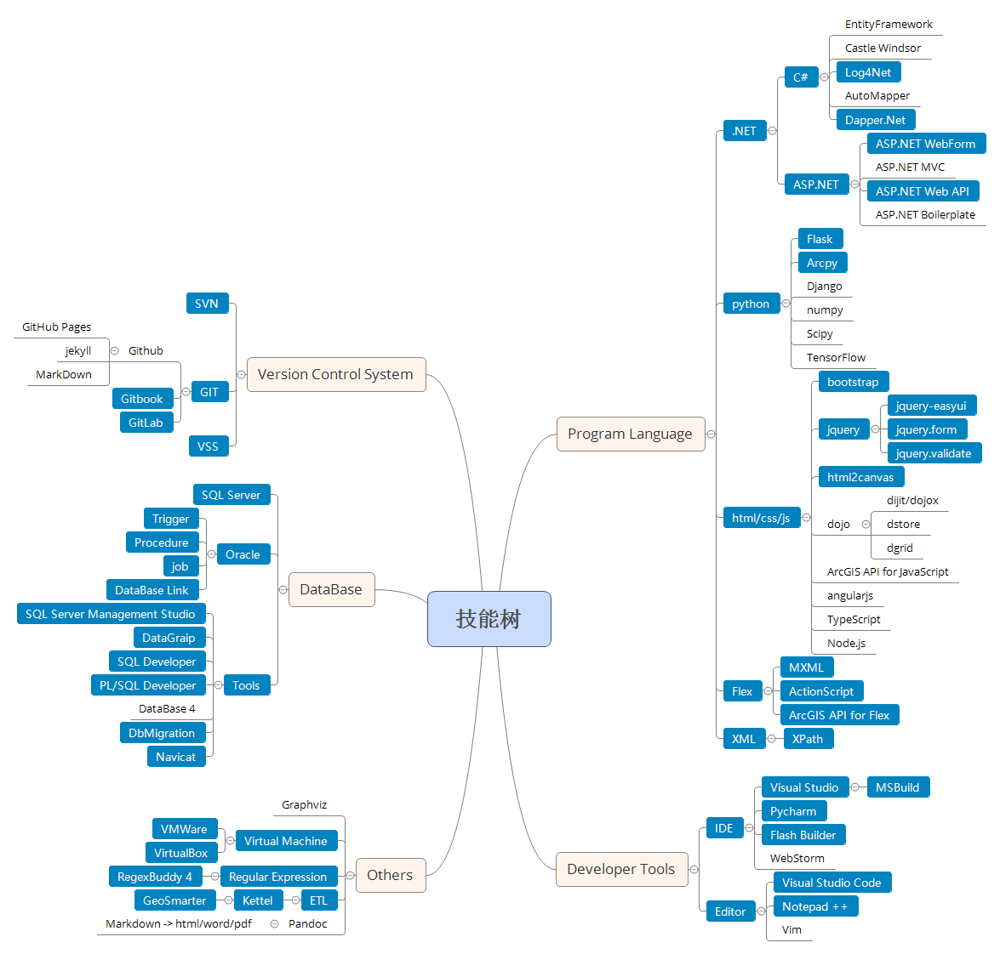

```
论一个逗比的自我修养
```

# 技能树



> 注： 图中蓝色部分为实际在项目中运用过的技能

# 工作经历

```
2013.07-2017.05 **武大吉奥信息技术有限公司**
```
  
在该公司主要负责沈阳“一张图”电子政务平台相关功能模块的开发和维护功能，期间做过的工作有：
1. 维护MSSQL+ASP.NET开发的业务审批及OA系统，利用UCML工作流引擎完成相关新流程的开发及现有流程的维护
2. 开发WebService后台服务接口为移动办公APP提供后台服务，并基于Oracle+ASP.NET+jQuery EasyUI开发后台数据管理系统
3. 使用ASP.NET Web API技术开发数据导出接口，在现有系统中嵌入数据导出模块
4. 维护基于ArcGIS API For Flex开发的图形端程序

# 教育经历

```
2010.09-2014.07 **沈阳建筑大学** 测绘工程/本科
```
